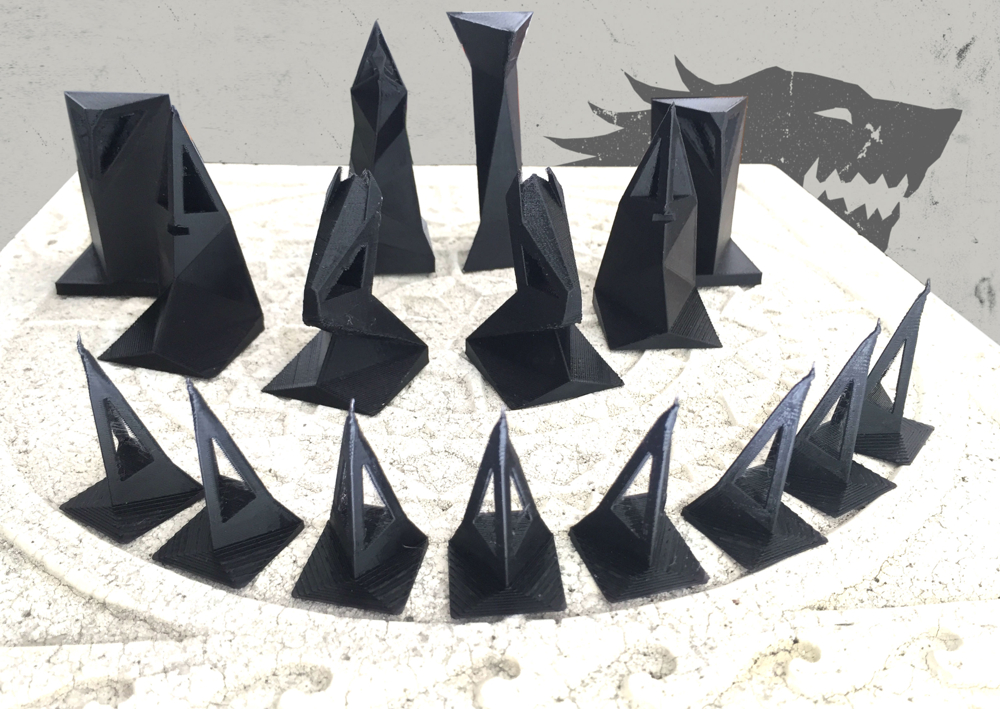

### chess_models

Chess of Thrones
================

My design for a 3D printed chess set. Solid form design for the white and hollow form design for the black. Bases for all pieces are square, with the exception of the king having a triangular base and head.
###### (Uploaded in skp and obj formats. Also including the Dremel 3d20 printer format - .g3drem)

